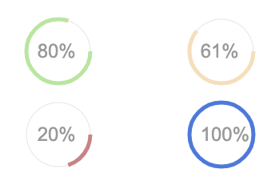

# 👽 Gauge raiz com JS

Este é um simples projeto que cria uma função em JS para renderizar um gauge simples em uma tag `canvas` no html.

## Modelo do gauge

O gauge raiz é bem simples e será como mostrado nos exemplos abaixo. Uma linha representará o percentual e ele será mostrado no centro da circunferência.

## Como usar

Baixe o código deste repositório seja vir um fork ou um clone e simplesmente abra o html com seu navegador preferido.

A estrutura é bem simples, cada tag `canvas` deve conter um gauge, logo faça a organização delas em um layout que te atenda.

O código __JS__ vai buscar cada o _canvas_ e enviar para uma função que irá renderizar o gauge através de mais alguns parâmetros.

A documentação no arquivo fonte `gauge.js` está bem simples e direta, você não terá dificuldades em ler, aprender a usar e modificar para suas necessidades.

__Bom trabalho__ e espero que lhe seja bem útil. Eu acredito que como é simples se sua necessidade for básica, ele vai funcionar bem.

// Alan Alencar, 2023